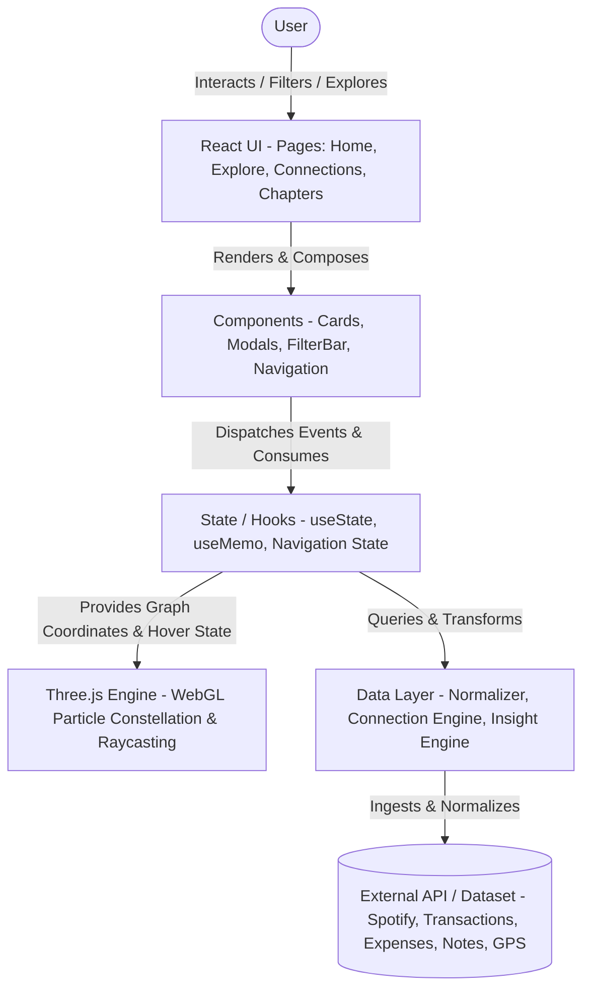
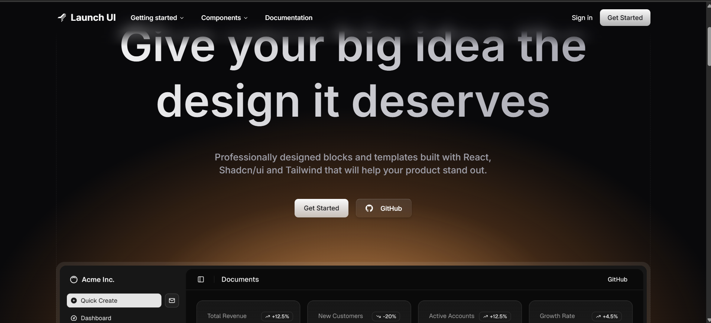

# 🧾 Your Life in Receipts

> **Turn your fragmented digital exhaust into an interconnected, interactive narrative constellation.**

[](https://vite.dev/)
[](https://react.dev/)
[](https://tailwindcss.com/)
[](https://threejs.org/)
[](https://greensock.com/gsap/)
[](https://reactflow.dev/)
[](https://www.framer.com/motion/)
[](LICENSE)

---

## 🌟 Overview

**Your Life in Receipts** is a personal digital archaeology platform that ingests multi-stream activity data—music streams, payment transactions, recurring expenses, GPS check-ins, and personal notes—and automatically synthesizes them into meaningful life chapters, synchronized moments, and interactive 3D graph constellations.

Instead of looking at isolated bank statements or listening histories in individual silos, **Your Life in Receipts** uncovers hidden correlations:
- *What song was playing when you bought that late-night coffee?*
- *What notes were written during a creative sprint at your favorite café?*
- *How did your habits, soundtrack, and environment evolve across different seasons of life?*

---

## 🛑 Problem Statement

Modern individuals produce an immense volume of digital artifacts across dozens of isolated applications every day:
- **Data Silos**: Spotify tracks listening history, Apple Card records spending transactions, Apple Notes captures thoughts, and Google Maps captures location history—yet none of these platforms communicate with one another.
- **Context Collapse**: Reviewing a financial transaction months later feels sterile. You see a \$4.75 charge at a coffee shop, but lose the emotional context: what you were working on, what track was playing in your headphones, or what personal milestone occurred that afternoon.
- **Cognitive Overload**: Raw data logs and monthly statements are passive and tedious. Users lack an engaging, visual way to explore the serendipitous intersections of their personal timeline.

---

## 💡 Solution

**Your Life in Receipts** transforms fragmented data into an interactive, memorable life tapestry:
1. **Universal Ingestion & Normalization**: Maps diverse data sources into a canonical `NormalizedReceipt` schema.
2. **Heuristic Correlation Engine**: Detects co-occurrences using temporal proximity, venue matching, and semantic topic tags.
3. **Automated Moment Clustering**: Bundles closely linked events into multi-sensory "Life Moments".
4. **Narrative Chapter Generation**: Chronologically segments life into thematic eras and behavioral trends.
5. **Interactive 3D WebGL & Node Constellations**: Offers both an ambient interactive Three.js 3D WebGL constellation and a full node-link relationship diagram powered by React Flow.
6. **Modern Glassmorphism & GSAP Motion**: Polished with frosted glass panels, magnetic physics, numerical roll-up counters, and dynamic cursor spotlights.

---

## ✨ Key Features

- 🌐 **Multi-Stream Data Ingestion**: Unified normalization pipeline across Spotify tracks, bank transactions, recurring subscriptions, GPS check-ins, and markdown notes.
- 🌌 **Three.js WebGL 3D Constellation**: Real-time 3D particle constellation engine with raycaster-driven hover states, camera fly-to orbits, and dynamic node connections.
- 💫 **GSAP Modern Motion Suite**:
  - Sequential entrance timeline for Hero headline, badges, and CTAs.
  - Magnetic button physics with elastic spring restitution (`elastic.out`).
  - Animated numerical roll-up counters for KPI metrics (`StatsCard`).
  - Staggered cascade entrance grid when filtering or searching receipts.
  - Dynamic cursor spotlight illumination and 3D perspective tilt on hover.
- 💎 **Glassmorphism Design System**: Frosted panels (`.glass-panel`), frosted cards (`.glass-card`), and glass pills (`.glass-pill`) with translucent tinting and specular edge bevels.
- ⚡ **Heuristic Connection Scoring Engine**: Multi-factor scoring algorithm evaluating temporal proximity, geographic overlap, semantic tag intersection, and cross-category synergies.
- 🔮 **Synchronized Life Moments**: Automated clustering algorithm grouping high-density, multi-modal events occurring within localized timeframes into rich narrative moments.
- 📖 **Narrative Life Chapters**: Chronological era generator extracting distinct life phases with dominant themes, top environments, and focus metrics.
- 🕸️ **Node-Link Relationship Graph**: Interactive graph canvas powered by `@xyflow/react` with custom node renderers, filters, and relationship strength badges.
- 📊 **Automated Behavioral Insights**: Algorithmic detection of night-owl habits, soundtrack correlation, focus anchors, and spend dynamics.
- 🛡️ **Comprehensive UX Resilience**: Custom animated loading skeleton beams, error fallback states with retry handlers, and smooth scroll progress indicator.

---

## ⚙️ How It Works

The platform functions in a four-stage analytical pipeline:

```text
[ Raw Data Streams ] ──> [ Normalizer ] ──> [ Correlation & Clustering ] ──> [ Three.js Engine & Reactive UI ]
```

1. **Ingestion & Normalization**: Diverse data structures (JSON records from music, banking, GPS, notes) are transformed into uniform `NormalizedReceipt` objects.
2. **Correlation Scoring**: The scoring engine compares pairs of receipts to evaluate shared temporal, spatial, and semantic relevance:

| Factor | Condition | Score Weight | Description |
| :--- | :--- | :---: | :--- |
| **Time Delta** | $\Delta t \le 15\text{ min}$ | `+4` | Immediate temporal co-occurrence |
| **Time Delta** | $15 < \Delta t \le 30\text{ min}$ | `+2` | Close temporal co-occurrence |
| **Time Delta** | $30 < \Delta t \le 120\text{ min}$ | `+1` | Same session co-occurrence |
| **Date Match** | Same calendar date | `+2` | Same-day relationship |
| **Location** | Exact venue name match | `+4` | Occurred at identical venue |
| **City** | Same city match | `+1` | Occurred in same metropolitan area |
| **Thematic Tags** | Shared keywords in `tags[]` | `+3` | Semantic / contextual overlap |
| **Cross-Activity** | Cross-domain synergy (e.g., Music + Food) | `+2` | Activity synergy bonus |

3. **Moment Synthesis**: Events scoring $\ge 6$ with shared temporal anchors are clustered into narrative moments.
4. **Chronological Chaptering**: Moments and receipts are grouped by calendar spans to reveal lifestyle patterns, dominant soundtrack moods, and primary venues.

---

## 💻 Tech Stack

| Category | Technology | Purpose |
| :--- | :--- | :--- |
| **Framework** | [React 19](https://react.dev/) | Component architecture, state management & reactive UI |
| **Build Tool** | [Vite 6](https://vite.dev/) | Lightning-fast HMR and optimized production bundling |
| **3D WebGL Engine** | [Three.js](https://threejs.org/) | 3D particle universe, raycasting node selection & orbit controls |
| **Animation Engine** | [GSAP 3](https://greensock.com/gsap/) | Magnetic physics, numerical roll-up counters, cascade entrances & spotlights |
| **Transition Animation** | [Framer Motion 12](https://www.framer.com/motion/) | Smooth layout transitions, modals, and route switching |
| **Styling** | [Tailwind CSS 3.4](https://tailwindcss.com/) | Modern utility-first styling, glassmorphic design tokens & dark theme |
| **Graph Visualization** | [@xyflow/react 12](https://reactflow.dev/) | Interactive node-link connection graph |
| **Icons** | [Lucide React](https://lucide.dev/) | Modern vector iconography |
| **Delight** | [Canvas Confetti](https://www.npmjs.com/package/canvas-confetti) | Moment celebration micro-interactions |

---

## 🏛️ Architecture

### System Flow Diagram

```text
User
 ↓
React UI
 ↓
Components
 ↓
State / Hooks
 ↓
Three.js Engine
 ↓
Data Layer
 ↓
External API / Dataset
```

### Architectural Breakdown



1. **User**: Navigating timelines, filtering receipts, triggering moment stories, and interacting with 3D nodes.
2. **React UI**: Top-level page controllers (`Home.jsx`, `Explore.jsx`, `Connections.jsx`, `Chapters.jsx`) directing view states.
3. **Components**: Modular sub-components (`HeroSection`, `DashboardMockup`, `PatternDiscoveries`, `FeaturedMoments`, `ReceiptCard`, `StatsCard`, `ReceiptDetailModal`, `MomentStoryModal`).
4. **State / Hooks**: Reactive data layer coordinating normalized memory with React hooks (`useState`, `useMemo`), caching connection graphs and calculated insight statistics.
5. **Three.js Engine**: High-performance WebGL canvas rendering spatial node clusters, radiant particle links, camera damping, and interactive raycasting.
6. **Data Layer**: Algorithmic core containing `normalizeData.js`, `connections.js`, `insights.js`, and `chapters.js` implementing heuristic scoring and era segmentation.
7. **External API / Dataset**: Source mock and production API inputs (`spotify.json`, `transactions.json`, `expenses.json`, `locations.json`, `notes.json`).

---

## 📂 Project Structure

```text
FrontendArena/
├── index.html                      # Root HTML entry template with fonts and metadata
├── package.json                    # Dependencies, scripts, and project metadata
├── package-lock.json               # Locked dependency tree
├── postcss.config.js               # PostCSS configuration with Tailwind CSS & Autoprefixer
├── tailwind.config.js              # Custom Tailwind theme, colors, fonts, and animations
├── vite.config.js                  # Vite bundler configuration with React plugin
├── ui.png                          # Application interface preview screenshot
├── README.md                       # Comprehensive project documentation
├── src/
│   ├── main.jsx                    # Application entry point rendering <App /> to DOM
│   ├── App.jsx                     # Root application container, state store & page router
│   ├── index.css                   # Glassmorphism system (.glass-panel, .glass-card, .glass-pill)
│   │
│   ├── constants/                  # Centralized theme tokens and color mappings
│   │   └── theme.js                # Shared category icons, color schemes & style maps
│   │
│   ├── data/                       # Raw source mock datasets
│   │   ├── spotify.json            # Track listens, artists, duration, timestamp, device
│   │   ├── transactions.json       # Merchant transactions, amounts, payment methods, locations
│   │   ├── expenses.json           # Recurring utility, housing & subscription expenses
│   │   ├── locations.json          # GPS check-ins with coordinates, place names, categories
│   │   └── notes.json              # Thought captures, tags, mood, markdown content
│   │
│   ├── utils/                      # Core data transformation & analytics algorithms
│   │   ├── normalizeData.js        # Normalizes heterogeneous raw data into uniform receipt schema
│   │   ├── connections.js          # Relationship scoring engine & moment clustering algorithm
│   │   ├── insights.js             # Automated statistical analysis & behavioral story generation
│   │   └── chapters.js             # Chronological life phase / narrative era generator
│   │
│   ├── pages/                      # Top-level view controllers
│   │   ├── Home.jsx                # Decomposed landing view calling modular home sections
│   │   ├── Explore.jsx             # Grid & spool view with GSAP cascade stagger & filters
│   │   ├── Connections.jsx         # Interactive React Flow node-link relationship graph
│   │   └── Chapters.jsx            # Narrative timeline of life eras and highlighted moments
│   │
│   └── components/                 # Modular, reusable UI components
│       ├── home/                   # Sub-components decomposed from Home view
│       │   ├── HeroSection.jsx     # Hero with GSAP entrance timeline & magnetic CTA button
│       │   ├── DashboardMockup.jsx # Interactive mockup with 3D constellation & spec tabs
│       │   ├── PatternDiscoveries.jsx # Grid of empirical data behavioral insights
│       │   └── FeaturedMoments.jsx # Spotlight-illuminated synchronized moment cards
│       │
│       ├── ThreeConstellation.jsx  # WebGL 3D constellation engine with raycasting hover
│       ├── LifeConstellation.jsx   # 2D ambient constellation canvas fallback
│       ├── ConnectionGraph.jsx     # Node-link graph canvas using @xyflow/react
│       ├── StatsCard.jsx           # KPI card with GSAP animated numerical counter roll-up
│       ├── ReceiptCard.jsx         # Tactile card with cursor spotlight glow & 3D tilt
│       ├── ChapterCard.jsx         # Visual summary card for a chronological life chapter
│       ├── InsightCard.jsx         # Visual card displaying behavioral statistics
│       ├── FilterBar.jsx           # Glassmorphic search input and category filter chips
│       ├── Navbar.jsx              # Frosted glass navigation bar with dropdown menus
│       ├── ReceiptDetailModal.jsx  # Detailed glass inspection modal with linked records
│       ├── MomentStoryModal.jsx    # Immersive step-by-step story view with confetti
│       ├── LoadingSkeleton.jsx     # Animated scanner beam loading skeleton
│       ├── ErrorState.jsx          # GSAP-animated error state with retry handler
│       ├── PageTransition.jsx      # Smooth page transition wrapper
│       └── ScrollProgress.jsx      # Viewport scroll depth indicator with luminous gradient
```

---

## 📦 Installation

Ensure you have [Node.js](https://nodejs.org/) installed (v18.0.0 or later is recommended).

1. **Clone the repository**:
   ```bash
   git clone https://github.com/akashkumar6205/FrontendArena.git
   cd FrontendArena
   ```

2. **Install dependencies**:
   ```bash
   npm install
   ```

---

## 🔐 Environment Variables

The project runs completely client-side with included sample datasets out of the box. No external keys are mandatory to run locally.

If connecting to external APIs or analytics in production, create a `.env` file in the root directory:

```env
# Optional Application Configuration
VITE_APP_NAME="Your Life in Receipts"
VITE_APP_ENV="development"

# Optional External API Integrations (Future Services)
VITE_SPOTIFY_CLIENT_ID=""
VITE_PLAID_CLIENT_ID=""
VITE_GOOGLE_MAPS_API_KEY=""
```

---

## 🚀 Running Locally

Execute the following script to start the local development server with Hot Module Replacement (HMR):

```bash
npm run dev
```

Once running, navigate to `http://localhost:5173` in your browser.

### Other Available Scripts

| Command | Action |
| :--- | :--- |
| `npm run dev` | Launches Vite local dev server on port `5173` with instant HMR. |
| `npm run build` | Compiles optimized production bundle into the `dist/` directory. |
| `npm run preview` | Spins up a local server to preview the built `dist/` bundle. |

---

## ☁️ Deployment

### Deploying to Vercel (Recommended)

1. Push your code to your GitHub repository.
2. Log into [Vercel](https://vercel.com/) and choose **Add New Project**.
3. Import the `FrontendArena` repository.
4. Vercel automatically detects the Vite build configuration:
   - **Framework Preset**: `Vite`
   - **Build Command**: `npm run build`
   - **Output Directory**: `dist`
   - **Install Command**: `npm install`
5. Click **Deploy**.

### Deploying to Netlify

```bash
npm run build
```
Upload or link the repository to Netlify with the publish directory set to `dist`.

---

## 📸 Screenshots


*Figure: The dark-themed analytics dashboard highlighting multi-stream data ingestion, interactive constellation nodes, metrics ticker, and chronological life chapters.*

---

## ⚡ Performance

- **WebGL & Canvas Acceleration**: 3D particle nodes and constellation links run on Three.js hardware acceleration with requestAnimationFrame loops, bypassing DOM re-render overhead.
- **Precomputed Memoization**: Computationally intensive operations (scoring connections, era clustering) are wrapped in `useMemo` hooks, preventing redundant $O(N^2)$ recalculations across page renders.
- **GSAP Hardware-Accelerated Transforms**: All hover tilts, magnetic springs, and spotlight gradients animate on `transform` and `opacity` properties to ensure 60fps GPU acceleration.
- **Fast Bundle Size**: Bundled using Vite 6 with tree-shaking and modern ES modules.

---

## ♿ Accessibility

- **Semantic HTML5**: Page layout is cleanly structured with proper `<nav>`, `<main>`, `<section>`, and `<article>` tags.
- **High-Contrast Dark Mode**: Designed using WCAG AA compliant text-to-background contrast ratios against dark surfaces (`#08090a` / `#121316`).
- **Keyboard Navigation**: Interactive elements, filter chips, and modals include distinct visual focus indicators and keyboard dismissal support (`Escape` to close modals).
- **Responsive Layout**: Fluid grids that adapt gracefully from small mobile screens (320px) up to ultra-wide desktop monitors with minimum 44px touch targets.
- **Reduced Motion Support**: Animations respect reduced motion preferences where supported.

---

## 🔮 Future Improvements

- [ ] **Live OAuth Integrations**: Real-time webhook ingestion from Spotify Web API, Plaid/Tink bank feeds, and Google Maps Timeline.
- [ ] **Interactive 3D Galaxy Shader**: Custom WebGL GLSL shaders for volumetric stellar dust and gravitational node orbits.
- [ ] **Local LLM Narrative Generation**: In-browser biography generation with WebLLM/Transformers.js summarizing chapters into literary memoirs.
- [ ] **Data Export & Privacy Vault**: End-to-end encrypted backup export to Obsidian Markdown vaults and encrypted JSON archives.

---

## 🛠️ Challenges & Solutions

### 1. Heterogeneous Data Formats
- **Challenge**: Raw data formats from music listening logs, bank transactions, notes, and geolocation records had fundamentally divergent schemas and date encodings.
- **Solution**: Designed an extensible adapter pipeline in `normalizeData.js` that unifies all entities into a standardized `NormalizedReceipt` model with unified timestamps, geospatial metadata, and categorization.

### 2. Scalable Relationship Scoring
- **Challenge**: Pairwise relationship calculation between every receipt pair scales quadratically ($O(N^2)$), causing frame drops when computing tens of thousands of links.
- **Solution**: Introduced temporal pre-filtering windows, bucketing records within calendar windows before applying granular multi-factor scoring (location, tag matching, cross-domain affinities).

### 3. High-Performance 3D Interaction
- **Challenge**: Rendering hundreds of data points with dynamic raycasting hover selection can bog down React render cycles.
- **Solution**: Decoupled the Three.js render loop into `ThreeConstellation.jsx`, caching meshes and using GPU raycasters with fallback 2D canvas states for low-power devices.

---

## 👥 Team / Credits

- **Creator & Lead Developer**: [Akash Kumar](https://github.com/akashkumar6205)
- **Repository**: [FrontendArena](https://github.com/akashkumar6205/FrontendArena)
- **Special Thanks & Open Source Tools**:
  - [React](https://react.dev/) & [Vite](https://vite.dev/)
  - [Three.js](https://threejs.org/)
  - [GreenSock GSAP](https://greensock.com/gsap/)
  - [Tailwind CSS](https://tailwindcss.com/)
  - [@xyflow/react](https://reactflow.dev/)
  - [Framer Motion](https://www.framer.com/motion/)
  - [Lucide Icons](https://lucide.dev/)
